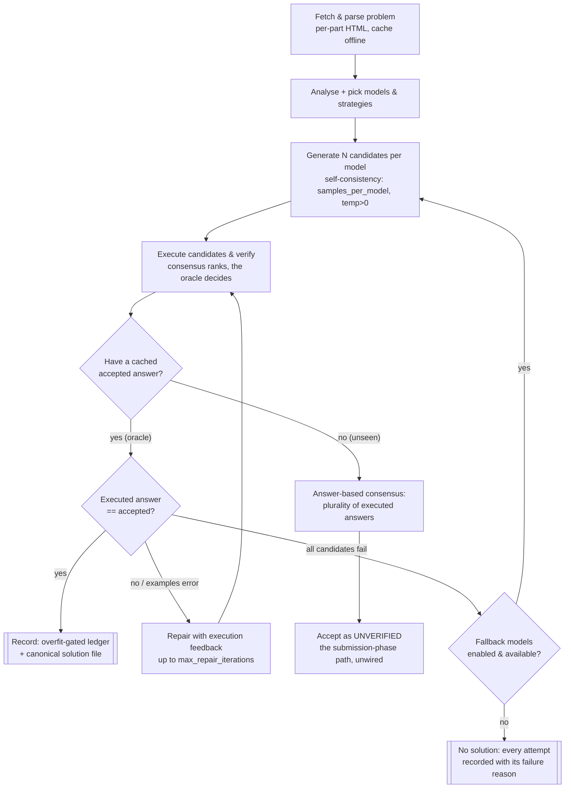

# Problem Solver

**A research platform for measuring whether coordinating several LLM attempts beats a single one —
and by how much.** Local models (via Ollama) propose solutions to Advent of Code problems; a
correctness oracle executes each candidate against the real puzzle input and compares it to the
accepted answer. Because the check is cheap and exact, every orchestration idea can be A/B'd for a
real delta over repeat trials, so results are evidence rather than anecdote.

It began as an unmeasurable pipeline. The through-line since has been to **make every claim
measured** — including correcting our own claims when later runs disprove them, which has happened
repeatedly and is recorded in place.

## Headline results

All measured on local models against an independent oracle; every figure links to a committed
write-up in [`dev/progress/`](dev/progress/).

**1. Coordinating attempts nearly doubles the solve rate — and we can now say *why*.**

On problems the strongest model solves only *sometimes* (its own frontier, identified beforehand by
an independent classification):

| approach | solve rate |
|---|---|
| 1 attempt, with self-repair from execution feedback | **42%** |
| 3 independent attempts, no feedback | **58%** |
| **3 attempts, each with execution feedback** | **75%** |

Sampling helps, repair helps, and **together they help more than the sum of their parts.** The
sharpest single case: a problem solved by **1 of 6** single attempts was solved by **3 of 3** runs
that combined both. (`passk-ab-d13-d15.md`)

**Replicated out of sample.** Repeated on **AoC 2025** — a year never previously measured, whose
frontier is *less* favourable to sampling (mostly all-or-nothing rather than near-misses) — the two
uncertain problems went from **25–33% → 100%**, while a problem that never solves stayed unsolved and
a problem that always solves was unaffected. Sampling rescued exactly the uncertain cases and nothing
else, which is the signature of a mechanism rather than a rate artifact.
(`passk-replication-2025.md`)

**2. Model *generation* beats model *size*, decisively.**

Three models of the same class on the same problems, each **smaller** than the last:

| model | size | class | solved |
|---|---|---|---|
| `qwen2.5-coder:32b` (late 2024) | 19 GB | code specialist | 4/8 |
| `qwen3-coder:30b` (newer, MoE) | 18 GB | code specialist | 6/8 |
| **`qwen3.8:27b` (2026)** | **17 GB** | **generalist** | **8/8** |

The 2024 specialist scored *below* what 12B models had achieved on half the RAM. The winner is the
smallest and is not a coding model at all. (`m2max-qwen38-27b-d4-7.md` and siblings)

**3. There is a hard limit, and it is not fixed by more attempts.**

**One problem has resisted every configuration**: 2025 d9 p2, **0 of 10** problem-trials across one
attempt, three attempts, with and without feedback. The model repeats *the same failing approach*
each time. **Sampling multiplies draws, not diversity:** where failure is systematic rather than
random, extra attempts re-roll the same die.

*(Corrected 2026-08-20: this originally claimed two such problems. 2024 d15 p2 is **not** a wall — it
has solved 2 of 16 times, a ~12% problem. See `dev/progress/CORRECTION-d15p2-is-not-a-wall.md`. The
claim now rests on one problem, not two.)*

**And we tested the obvious fix — it failed.** Raising sampling temperature from 0.7 to 1.0 moved
neither problem and slightly *hurt* a problem that already worked
(`temperature-diversity-negative.md`). **Reworded repair feedback was tested next — also null**
(`targeted-feedback-negative.md`), and the five falsified hypotheses now form a rule: **interventions
that add no new information do not help, however well-targeted the wording.** What has worked adds
real information — sampling contributes independent draws, repair contributes a traceback. The
surviving candidates under that filter supply something genuinely new: a second model's differing
answer (untested), or a failing case the model has not seen (design stage). **2025 d9 p2 (0/13)** is
the standing benchmark any such claim must move.

**4. Measurement bugs flatter no one, and finding them is half the work.**

Roughly half the effort behind these numbers went into discovering that earlier measurements were
wrong — a crash being recorded as "the model failed" (for eight months), an anti-overfit gate
*rejecting correct solutions*, invented rows in the results database, and tests writing into the live
measurement store. All are fixed, with regression tests; the claims they corrupted are corrected in
place rather than quietly restated. In a project whose premise is *measured, not asserted*, a broken
instrument is the most expensive kind of bug.

**5. Cheap draws beat one expensive pass — on time, not on tokens.**

At a matched wall-clock budget, a fast weak model taking many draws vs a slow strong model taking few:

| | solved | **s / verified solution** | **tokens / verified solution** |
|---|---|---|---|
| `qwen3.8:27b` k=3 (slow, strong) | **8/8** | 1,389 s | **38,460** |
| `qwen3-coder:30b` k=12 (fast, weak) | 7/8 | **891 s** (0.64×) | 128,730 (3.35×) |

**The answer depends on which cost you pay:** for local GPU inference, where cost is *time*, many
cheap draws win by 36%. For a token-metered API they lose by 3.35×. And volume does not close the
capability gap — 7/8 vs 8/8. Which problem it bought is the now-familiar split: a ~25%-per-draw
*parsing* failure fell to four times the draws; a *systematic* one (6/6 identical `TypeError`s) did
not. (`economic-arm-moe-vs-generalist.md`)

**6. The structural findings generalise to a second year.**

Tested out of sample on **AoC 2025 d1–12** — never measured, 23 scoreable parts — the model scored
**16/23 (70%)**, and the structure carried over: a real frontier exists, the **Part 1/Part 2 cliff
recurs** (83% vs 55%, six of seven misses are Part 2s), and the same failure classes reappear. The
ledger stands at **43 verified solutions across two years**. (`generality-2025-scan.md`, `band-2025-classification.md`)

**Scope, stated plainly:** these findings rest on one strong model and three trials per cell, and
the statistics deserve one honest sentence: the 2024 headline **alone is marginal** (one-sided
Fisher exact p ≈ 0.06 on the aggregate); it is the **out-of-sample replication** (2025: 2/8 → 6/6,
p ≈ 0.009; combined p ≈ 0.005) that makes the sampling claim solid. Rates are not comparable across
the two years — the problem ranges are not difficulty-matched.

## What it is

**The larger objective is generalized problem-solving through LLM orchestration** — extracting more
correctness from models by *how* they're combined (sampling, consensus, verification, repair, diverse
ensembles) than any single model yields alone. Advent of Code is the current testbed, not the point:
it supplies a stream of self-contained problems with a cheap correctness check, which is exactly what
makes the orchestration question measurable.

Structurally the machine is a **proposer–verifier loop**: local models *propose* solutions — they're
prediction machines, cheap and fallible and high-variance — and a cheap, exact **verifier** (run the
code, compare to the accepted answer) *disposes*. Truth enters through the parts that don't predict,
and that asymmetry is why coordinating predictors pays off at all: sampling, voting, and repair
convert into correctness only because a cheap check can collapse many guesses to one verified answer.
Where no such check exists, the coordination has little to grip — which is also where this approach
stops being a good fit.

Concretely, that objective is pursued through two pieces, in order of importance:

1. **A measurement platform.** A frozen, fingerprinted `SolverConfig`; an experiment harness
   (`experiment.py`, `shared/experiment/`) that runs a problem set under one or more configs with
   `--trials N`; a correctness **oracle** (`shared/verification.py`, `shared/ground_truth.py`) that
   judges every candidate against the cached accepted AoC answer, with an overfit gate
   (`shared/overfit_detection.py`); and independent verification so *claimed* and *verified* are
   never conflated. This is what lets an orchestration idea be A/B'd for a real delta.

2. **An AoC solver.** `BaseSolver.solve_problem` (`shared/solver.py`) is a short orchestrator over
   four stages — prepare → generate → consensus → execute/repair/fallback — driving local models to
   solve a puzzle and recording verified solutions to a ledger (`solutions/README.md`).

## Architecture & decision workflow

The pipeline that measurably works. A model's *text* is never trusted; only code that **executes to
the accepted answer** is recorded. Self-consistency fans out several candidates; the oracle decides;
a repair loop and fallback models get extra shots before giving up.



Every arrow that ends in a record is **oracle-gated** — a wrong or overfit candidate is refused, not
logged as solved. Every attempt (solved or not) is recorded with its outcome and failure reason, so
runs are diagnosable after the fact.

## What the measurements found

Every one of these is a committed A/B or analysis in `dev/progress/`, not an assertion:

- **Single runs are noise.** The pipeline is non-deterministic; across byte-identical configs,
  4 of 6 baseline problems flipped between solved and unsolved. Reporting needs repeat trials.
- **Self-consistency is a real win.** Drawing several samples per model (`samples_per_model`) at
  `temperature>0` lifted the solve rate **39% → 61%** on 2024 d1–3 and took **0 → 3 of 6** problems
  to *solved every trial*. It cures run-to-run variance on problems the model can already sometimes
  solve. (`dev/progress/milestone-e-self-consistency.md`)
- **Answer-based consensus is a good no-oracle selector.** On the sample data, plurality vote over
  the *executed* answer would have picked the correct answer 10/11 times — the selector the
  submission phase needs. (`dev/progress/milestone-e-answer-consensus.md`)
- **Model capability dominates on the hard problems — and it was mis-assumed.** On the never-scored
  2024 d4–7, `qwen2.5-coder:7b` (the original baseline) solves only **1 of 8**. But two newer models
  that *also fit 16 GB* — `qwen3.5:9b` and `gemma4:12b` — reach **5 of 8** and crack Part 2s the 7B
  never touches. Self-consistency fixes *variance*; a better model is what adds *capability*. So "the
  7B is too weak past the easy problems" is measured, not assumed — and so is the fix.
  (`dev/progress/scale-2024-d4-7.md`, `9b-confirmation-d4-7.md`, `model-bakeoff-gemma4-vs-9b.md`)
- **Reasoning models need a leash.** A reasoning model (`qwen3.5:9b`) left to think freely emits
  tens of thousands of chars of chain-of-thought and never reaches the code; an `enable_thinking=false`
  toggle turns it into a fast, direct coder. Capability is only useful if the harness can extract it.
- **The 16 GB ceiling: two different walls, and our first diagnosis conflated them.**
  The hardest Part 2s (2024 d5 p2, d6 p2) stayed unsolved for every 16 GB model, and a 5×
  execution-timeout recovered nothing, so we read it as "the model finds the right idea but writes
  code too slow" (`dev/progress/9b-timeout-investigation.md`). The M2 Max runs split that in two:
  **d5 p2 was never speed-bound** — a newer model solved it with a **Kahn's-algorithm topological
  sort**, an approach the earlier models never proposed — while **d6 p2 genuinely was**, falling to
  a plain brute force that finally ran inside the timeout on faster hardware. One algorithm wall,
  one speed wall, described for months as a single phenomenon. Both are now solved and in the
  ledger. (`dev/progress/m2max-qwen38-27b-d4-7.md`, `m2max-qwen3coder30b-d4-7.md`)

The honest headline, scoped precisely: **on this fixed problem set, the binding constraint was model
capability, not orchestration** — and on 32 GB that constraint dissolved once a *newer-generation*
model was available: `qwen3.8:27b` solved **all 8**, while a bigger *older* model did worse than
16 GB managed. The set is now exhausted as a capability measure. Every part is measured, not
assumed. Full numbers:
`dev/benchmarks/cross-machine-results.md`. But that describes *a fixed band of problems*, not
orchestration in general — which raises the project's central open question.

## Does orchestrated voting scale? (measured: yes at k=3 — with one instructive exception)

Frontier models are trained to be the best solver *on their own*, and hardware keeps growing — so why
orchestrate several votes at all? This is the question that carries the work beyond AoC, so it earns
an answer separate from our solve rates, honest about what is argued versus proven.

**Why voting should keep its value as models strengthen:**

1. **The pass@k-vs-pass@1 gap never closes at a model's own frontier.** Every model samples from a
   distribution; on the hardest problems it can *sometimes* solve, the modal answer isn't reliably
   correct but the right one appears among several draws. Sampling N and selecting by consensus or a
   verifier turns "sometimes" into "solved" (self-consistency; best-of-N). A stronger model needs
   fewer draws, but the gap reappears at *its* harder frontier — the value moves up with the model
   rather than vanishing.
2. **A cheap verifier turns k draws into one answer — an economic scaling law.** Where correctness is
   checkable (our oracle, unit tests, a compiler, a proof checker), many cheap draws plus selection
   can beat one expensive "think-harder" pass at equal or lower cost — a trade that only improves as
   per-draw cost falls.
3. **Diverse portfolios decorrelate error.** Even a frontier model has systematic blind spots; an
   ensemble of *different* models wins where their mistakes are uncorrelated. Being individually best
   doesn't remove correlated failure modes.

**What we've shown** (evidence): sampling + consensus adds correctness — self-consistency **39% →
61%**, 3 of 6 problems made reliable; the no-oracle selector picked correct **10/11**.

**Arm 2 is now measured, and it splits.** *Many cheap draws beat one expensive pass* is **true on
wall-clock** (0.64× per verified solution) and **false on tokens** (3.35×), and volume does not reach
the stronger model's ceiling (7/8 vs 8/8). The useful form of the claim: *cheap draws win when the
binding cost is time, not tokens, and only up to the cheap model's ceiling.*
(`economic-arm-moe-vs-generalist.md`)

**Arm 3 remains untested — for want of a suitable model pair, not for want of trying.** Two attempts
have failed at the entry condition rather than at the mechanism: the M1's same-tier pair, and a
cross-generation pair whose second model turned out to solve a **strict subset** of the first's
problems (`ensemble-precheck-negative.md`). An ensemble can only pool what its members
*differentially* solve; neither pair had that. The entry criterion is now explicit — measure each
member individually on the targets first.

**A measured caution on arm 3.** The one ensemble we ran on 16 GB did *not* pay off:
`gemma4:12b`+`qwen3.5:9b` — two same-tier models with *apparently* complementary solves — stayed at
**5/8** (no gain over the better single model, ~2.2× cost), because the distinguishing solve turned
out to be sampling noise, not a robust competency. Diversity converts to correctness only when
members' distinct strengths are *reproducible* — a real constraint on arm 3, not a refutation of it.
(`dev/progress/ensemble-samp3-d4-7.md`)

**What we haven't** (the honest gap): on our *fixed* d4–7 set, `gemma4:12b` at 1 sample matched
`qwen3.5:9b` at 3 — a stronger model needed *less* voting. But that measures a fixed set, not
scale-invariance: the strong model had headroom there. The decisive test — sampling + voting at a
*strong* model's own frontier (**pass@k vs pass@1** on problems it solves only sometimes) — has
still not been run as a controlled A/B.

**New, unplanned evidence for arm 1 (2026-08-16).** The 30B-class capability run supplied a
preview. At `samples_per_model=3`, `qwen3-coder:30b` solved the two hardest problems it got —
**d4 p2 on 1 of 3 draws, d5 p2 on 1 of 4** — while every easy problem solved 3/3. That is the
predicted shape exactly: voting adds nothing where the model is reliable, and buys problems at its
frontier. At 1 sample the run would most likely have scored 4/8 instead of 6/8. It is **suggestive,
not conclusive** — one trial, and the counterfactual is inferred from which draw won rather than
measured. But the frontier band the real A/B needs now exists on a model strong enough to matter.
(`dev/progress/m2max-qwen3coder30b-d4-7.md`)

**THE DECISIVE TEST HAS NOW RUN (2026-08-17).** On `qwen3.8:27b` — the model that had outgrown
every earlier problem set — at its *own* measured frontier: **pass@1 42% → pass@3 75%**
(`dev/progress/passk-ab-d13-d15.md`). The band was selected beforehand by an independent 3-trial
classification, and the theoretical curve was registered in writing before the k3 arm ran.
(Precisely: *1 sample vs 3 samples with the repair loop held constant at 2 iterations in both arms* —
so this is "k samples + repair", not textbook pass@k over independent draws. The follow-up experiment
separates the two.)

The clearest case: a problem solved by **1 of 6** single draws was solved by **3 of 3** k3 trials —
the mechanism exactly as argued, with a cheap verifier collapsing several draws to the correct one.
It is also a problem we twice called an "insight wall", so **sampling reaches insight problems, not
only fiddly ones.**

**And one problem refutes the naive version of the claim.** d15 p2 sits at 33% per draw, predicts
70% at k=3, and scored **0 of 3** — nine samples, no solve. **Sampling multiplies draws, not
diversity:** where a model fails *systematically* (here, the same too-slow approach every time),
extra draws re-roll the same die. That is a real boundary on arm 1, and it relocates the next lever
from *more samples* to *more diverse samples* — temperature, prompt variants, different models.

**In short:** the mechanism adds correctness at a strong model's frontier, measured rather than
argued. What is now open is sharper and more useful — **when does sampling fail, and what
decorrelates draws?** Caveats held plainly: n=3 trials per problem, k=5 not run (no dose-response
curve or saturation point), one model, one temperature, four problems.

## Running an experiment

The platform's primary entry point is `experiment.py`:

```bash
# One config over 2024 days 1-3, 5 trials (the pipeline is non-deterministic)
venv/bin/python experiment.py --problems 2024:1-3 --trials 5 \
    --config "name=baseline,models=qwen2.5-coder:7b"

# A/B two configs and print a comparison (self-consistency isolated)
venv/bin/python experiment.py --problems 2024:1-3 --trials 3 \
    --config "name=samp1,models=qwen2.5-coder:7b,temperature=0.7,samples_per_model=1" \
    --config "name=samp3,models=qwen2.5-coder:7b,temperature=0.7,samples_per_model=3"

# Score already-recorded solutions without calling a model
venv/bin/python experiment.py --problems 2024:1-6 --dry-run
```

`--config` takes `key=value` overrides of `SolverConfig`; every field that enters the config
fingerprint changes what a run does, so two configs with different fingerprints are genuinely
different experiments. Verify the recorded solutions at any time with `dev/verify_solutions.py`.

## Solving a single problem

```bash
python solve.py --year 2024 --day 1 --part 1   # --force to re-solve, --debug for logs
```

## Data, privacy, and Advent of Code's rules

AoC asks that **puzzle text and puzzle inputs not be redistributed**, and inputs are per-account
anyway. This repo is built so that constraint is structural rather than a matter of remembering:

**Never committed** (all of `years/` is gitignored): puzzle HTML, puzzle inputs, and the scraped
accepted answers the oracle reads. A fresh clone therefore has *no* AoC data and cannot run the
oracle until you supply a session cookie for your own account (see below) or copy `years/` from a
machine that has it. This is why `dev/verify_solutions.py` reports "missing input file" on a clean
checkout — working as intended.

**Also never committed:** the session cookie and contact string. Both live in `.env`, which is
gitignored; `.env.example` ships placeholders only.

**Committed by design:** the solver's own generated Python solutions (`solutions/`), the verified
ledger with the answers they produce (`solutions/README.md`), and the experiment write-ups in
`dev/progress/`. The write-ups and a few regression fixtures quote **short fragments of the public
worked *examples*** (never real inputs) where a specific parsing failure has to be shown to be
understood.

**Raw run artifacts** (`dev/experiments/*.json`) are gitignored too — they can embed generated source
and execution output. The numbers that matter are transcribed into the committed findings.

### Why we believe this is compliant

AoC's [about page](https://adventofcode.com/about) asks (verbatim):

> *"Please don't. Advent of Code is free to use, not free to copy. If you're posting a code
> repository somewhere, please don't include parts of Advent of Code like the puzzle text or your
> inputs."*

and separately permits:

> *"You may link to or reference puzzles from Advent of Code in discussions, classes, source code,
> printed material, etc."* … *"Advent of Code does not claim ownership or copyright over your
> solution implementation."*

Mapping that onto what this repo contains:

| what | where | why it's fine |
|---|---|---|
| puzzle text, inputs, scraped answers | **not committed** (`years/`, gitignored) | exactly what the guideline asks us to exclude |
| generated solution code | `solutions/` | explicitly ours; AoC disclaims ownership of solutions |
| accepted answers | `solutions/README.md` | not covered by the request, and **per-account** — our answers cannot help anyone else, since a different account gets a different input and a different answer |
| short worked-*example* fragments (e.g. one input line) | a few findings + regression fixtures | *referencing* a puzzle to explain a specific parser failure, which the guideline permits; no puzzle is reproduced and nothing is spoiled |

The example fragments are deliberately minimal and load-bearing: the overfit-gate regression tests
cannot assert on example-literal reuse without an example literal, and a finding that says "the model
crashed parsing this line" is unverifiable without the line. They are illustrative, not a
redistribution of the puzzles.

One timing note for anyone reusing this: publishing *current-year* solutions during the December
event cuts against community norms even where it is permitted. Everything measured here is from past
years.

## Getting started

1. One-shot setup (venv + deps + `.env` scaffold + a RAM-matched model tier):
   ```bash
   ./scripts/setup.sh
   ```
   Or by hand — always into the project venv, never a bare `pip` (see `AGENTS.md`):
   ```bash
   python3 -m venv venv
   venv/bin/python -m pip install -r requirements.txt -r requirements-dev.txt
   ```
2. Install [Ollama](https://ollama.ai) and pull at least one coding model (the solver checks which
   configured models are actually installed and errors clearly if none are):
   ```bash
   ollama pull qwen2.5-coder:7b
   ```
3. `AOC_SESSION`: needed to **fetch** problems, inputs, and the accepted answers the oracle scores
   against. `years/` is gitignored — a fresh clone has no cached data, so the oracle cannot run
   until you either fetch with a session cookie (see the steps below; put it in `.env`, gitignored)
   or copy `years/` from a machine that has it. Once cached, everything runs offline. Note the
   accepted answers only exist for days *your account* has solved — that's what makes them ground
   truth.
4. Run tests: `PYTHONPATH=. venv/bin/pytest -q` (green without cached data too — the data-dependent
   tests skip themselves, reported as skips).

To get the session cookie (Safari): enable the Develop menu (Settings → Advanced → "Show features
for web developers"), log in to adventofcode.com, open Web Inspector (⌥⌘I) → Storage → Cookies →
adventofcode.com, and copy the **`session`** value. It is a secret — keep it in `.env`, never commit
it.

## Advent of Code parts and examples

Each AoC day's page has one or two `<article class="day-desc">` blocks — Part 1 uses the first,
Part 2 the second. Only the selected article is parsed and sent to the models, so each part is
solved in isolation (no Part 2 text leaks while solving Part 1). The parser extracts the example
`<pre><code>` block and infers its expected output from the surrounding prose, giving a small-input
oracle alongside the cached full-input answer.

## How the code is organized

```
experiment.py            Experiment harness entry point (--trials, --config, A/B)
solve.py                 Single-problem entry point
shared/
  experiment/            The platform: SolverConfig, results, runner
  verification.py        Correctness oracle (candidate vs accepted answer)
  ground_truth.py        Cached accepted answers
  overfit_detection.py   Overfit gate before a solution is recorded
  solver.py              BaseSolver.solve_problem orchestrator + stages
  aoc.py                 AoC I/O: session, HTTP, problem fetch + cache
  paths.py               Path primitives (leaf module, no cycles)
  ledger.py              Oracle-gated solution recording
  llm/                   Ollama provider (local.py) + prompts.py
  strategy_recommender.py, strategies.py   Strategy seeding
learning/                One SQLite DB: model + strategy performance
submission/              Real AoC submitter -- isolated and UNWIRED (reserved for the solver phase)
solutions/               Verified solutions + the ledger (README.md)
dev/progress/            The measured findings (baselines, A/Bs, the capability frontier)
dev/benchmarks/          Cross-machine results, keyed by hardware (solve rate by model/config)
years/                   Cached problem data (gitignored)
```

`PLAN.md` (repo root) is the forward roadmap; `dev/progress/checkpoint.md` is the live status
snapshot and `dev/docs/architecture.md` the design overview.

## What it's suited to (and what it isn't)

The testbed is AoC, but the *shape* of problem the pipeline handles well generalises. It works best
where a candidate can be **checked automatically and cheaply**:

- **Well-suited:** self-contained algorithmic problems with a deterministic answer and a fast check —
  parsing, simulation, small graph/grid work, arithmetic-heavy puzzles. The oracle (or example
  cases) gives an unambiguous pass/fail, so self-consistency and the repair loop have a signal to
  climb. This is the sweet spot AoC Parts 1 and early Part 2 live in.
- **Less-suited:** problems whose answer is subjective or expensive to verify (no oracle → the whole
  measured-not-asserted premise weakens), and problems where the *idea* is easy but the naive
  implementation is too slow for the real input — the hard AoC Part 2s. There the limit is algorithm
  efficiency, which orchestration can't manufacture.

In short: **the harness turns model capability into verified solutions wherever there's a cheap
checker; it can't invent capability the model lacks, nor a faster algorithm than the model writes.**

## Status

**Working and measured:** the full solve pipeline (fetch → parse → generate → consensus →
execute/verify → repair → fallback), the experiment harness with repeat trials and fingerprinted
configs, the correctness oracle and overfit gate, self-consistency and answer-based consensus, and
**43 verified solutions** across two AoC years (`dev/verify_solutions.py` clean).

**Established** — see *Headline results* above and the write-ups in `dev/progress/`:
- Coordinated attempts beat single attempts at a strong model's own frontier (**42% → 75%**), with
  sampling and repair contributing separately and superadditively.
- **Generation beats size**: a 17 GB 2026 generalist swept a set where a 19 GB 2024 specialist
  managed half, scoring below what 12B models achieved on half the RAM.
- **A named limit**: where a model fails *systematically*, extra attempts do nothing — 2025 d9 p2 is
  0/13 across every configuration tried. Diversity, not volume, is the lever there. (One problem, not
  the two originally claimed: `dev/progress/CORRECTION-d15p2-is-not-a-wall.md`.)
- Earlier "efficiency ceiling" and "capability" claims have been **corrected in place** as later runs
  disproved them; the corrections are part of the record, not edits over it.

**Open, in priority order:**
- **Does any of this generalise?** Everything above rests on one model and one year. **AoC 2025
  (d1–12, 23 problem-parts) is now prepared** as a second, never-measured evaluation set — the
  cheapest available test of whether these patterns are real or artifacts of 2024's problems.
- **What decorrelates draws?** The 0/8 failure says repetition is not diversity. Temperature,
  prompt variants, and model mixing are each a cheap A/B against a known-resistant problem.
- **The economic arm:** *many cheap draws vs one expensive pass at equal cost.* We have the pair to
  test it — a MoE that is ~4× faster than the strongest model. Blocked on a known token-accounting
  bug (repair attempts report duplicated counts), which must be fixed before any cost claim.
- **Known instrument gaps, logged not hidden:** solver crashes are scored in the same bucket as model
  failures (they want a distinct `HARNESS_ERROR` outcome), and generated code that catches its own
  exception and prints an error string is scored `wrong` rather than `error`.

**Deliberately unwired:** the AoC answer submitter (`submission/`) is real and tested in isolation
but kept out of the solve loop by design — the evaluation set is *past* AoC years, already solved on
the maintainer's account, so there is no unseen answer to submit. Wiring it is the live-contest path.

## Credits & license

Developed by **Martin Diekhoff**. MIT License — see [LICENSE](LICENSE).
