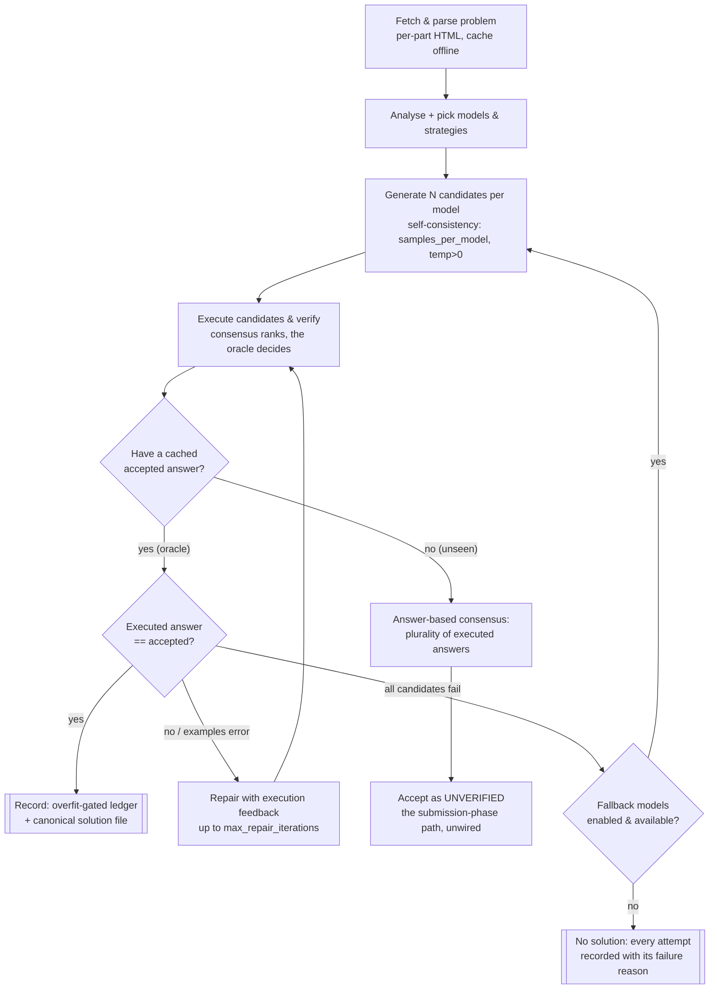

# Problem Solver

A research platform for **measuring LLM orchestration**, using Advent of Code as its testbed. It
attempts autonomous solutions with local LLMs (via Ollama) and — more importantly — measures how
well different orchestration strategies actually work, against a correctness oracle, with repeat
trials, so results are evidence rather than anecdote.

The project began as an unmeasurable pipeline. Its through-line since has been: **make every claim
measured.** The sections below capture what that produced.

## What it is

Two things, in order of importance:

1. **A measurement platform.** A frozen, fingerprinted `SolverConfig`; an experiment harness
   (`experiment.py`, `shared/experiment/`) that runs a problem set under one or more configs with
   `--trials N`; a correctness **oracle** (`shared/verification.py`, `shared/ground_truth.py`) that
   judges every candidate against the cached accepted AoC answer, with an overfit gate
   (`shared/overfit_detection.py`); and independent verification so *claimed* and *verified* are
   never conflated. This is what lets an orchestration idea be A/B'd for a real delta.

2. **An AoC solver.** `BaseSolver.solve_problem` (`shared/solver.py`) is a short orchestrator over
   four stages — prepare → generate → consensus → execute/repair/fallback — driving local models to
   solve a puzzle and recording verified solutions to a ledger (`solutions/README.md`).

## Architecture & decision workflow

The pipeline that measurably works. A model's *text* is never trusted; only code that **executes to
the accepted answer** is recorded. Self-consistency fans out several candidates; the oracle decides;
a repair loop and fallback models get extra shots before giving up.



Every arrow that ends in a record is **oracle-gated** — a wrong or overfit candidate is refused, not
logged as solved. Every attempt (solved or not) is recorded with its outcome and failure reason, so
runs are diagnosable after the fact.

## What the measurements found

Every one of these is a committed A/B or analysis in `dev/progress/`, not an assertion:

- **Single runs are noise.** The pipeline is non-deterministic; across byte-identical configs,
  4 of 6 baseline problems flipped between solved and unsolved. Reporting needs repeat trials.
- **Self-consistency is a real win.** Drawing several samples per model (`samples_per_model`) at
  `temperature>0` lifted the solve rate **39% → 61%** on 2024 d1–3 and took **0 → 3 of 6** problems
  to *solved every trial*. It cures run-to-run variance on problems the model can already sometimes
  solve. (`dev/progress/milestone-e-self-consistency.md`)
- **Answer-based consensus is a good no-oracle selector.** On the sample data, plurality vote over
  the *executed* answer would have picked the correct answer 10/11 times — the selector the
  submission phase needs. (`dev/progress/milestone-e-answer-consensus.md`)
- **Model capability dominates on the hard problems — and it was mis-assumed.** On the never-scored
  2024 d4–7, `qwen2.5-coder:7b` (the original baseline) solves only **1 of 8**. But two newer models
  that *also fit 16 GB* — `qwen3.5:9b` and `gemma4:12b` — reach **5 of 8** and crack Part 2s the 7B
  never touches. Self-consistency fixes *variance*; a better model is what adds *capability*. So "the
  7B is too weak past the easy problems" is now measured, and so is the fix.
  (`dev/progress/scale-2024-d4-7.md`, `9b-confirmation-d4-7.md`, `model-bakeoff-gemma4-vs-9b.md`)
- **Reasoning models need a leash.** A reasoning model (`qwen3.5:9b`) left to think freely emits
  tens of thousands of chars of chain-of-thought and never reaches the code; an `enable_thinking=false`
  toggle turns it into a fast, direct coder. Capability is only useful if the harness can extract it.
- **The remaining ceiling is algorithm *efficiency*, not the harness.** The hardest Part 2s (2024 d5
  p2, d6 p2) stay unsolved for every 16 GB model: the model finds the right idea but writes code too
  slow for the full input, and a 5× execution-timeout recovers nothing. That needs a smarter
  algorithm — a stronger model or a genuine reasoning step — not more tuning.
  (`dev/progress/9b-timeout-investigation.md`)

The honest headline, scoped precisely: **on this fixed problem set and hardware, the binding
constraint was model capability, not orchestration** — on 16 GB the capability that fits has a clear
frontier (reliable on easy problems; strong models reach the medium ones; the efficiency-bound
Part 2s remain out of reach). Every part of that sentence is measured, not assumed. Full
cross-hardware numbers: `dev/benchmarks/cross-machine-results.md`.

That is a statement about *a fixed band of problems*, though — not a verdict on orchestration in
general. Why an orchestrated voting layer can keep paying off no matter how strong the model or
hardware gets is the project's central open thesis, below.

## Does orchestrated voting scale? (the central open thesis)

A fair challenge: frontier models are trained to be the single best solver *on their own*, and
hardware keeps growing — so why orchestrate several votes at all? This is the question that would
carry the work beyond AoC, so it deserves an answer stated separately from our solve rates, and with
integrity about what is argued versus what is proven.

**The mechanistic case that voting keeps its value as models strengthen** — three reasons it
shouldn't simply wash out:

1. **The pass@k-vs-pass@1 gap never closes at a model's own frontier.** Any model, however strong,
   samples from a distribution; on the hardest problems it can *sometimes* solve, the single
   most-likely answer isn't reliably correct, but the correct one shows up among several draws.
   Sampling N times and selecting by consensus or a verifier converts "solves it sometimes" into
   "solves it" (self-consistency; best-of-N). A stronger model needs fewer draws — but the gap it
   exploits *reappears at its new, harder frontier*. The value moves up with the model rather than
   vanishing.
2. **A cheap verifier turns k draws into one answer — an economic scaling law, not a crutch.** Where
   correctness is checkable (our oracle, unit tests, a compiler, a proof checker), many cheap draws
   plus selection can beat one expensive "think-harder" pass at equal or lower cost. That trade
   becomes *more* attractive as per-draw cost falls, which is the direction hardware moves.
3. **Diverse portfolios decorrelate error.** Even a frontier model has systematic blind spots; an
   ensemble of *different* models/strategies wins precisely where their mistakes are uncorrelated.
   Being individually best doesn't remove correlated failure modes — diverse orchestration attacks
   the residual.

**What we have actually shown here (evidence, not speculation):** sampling + consensus works *as a
correctness mechanism* — self-consistency lifted **39% → 61%** and made 3 of 6 problems solve *every*
trial; and the no-oracle selector works — plurality over executed answers picked correct **10/11**.

**The honest counterweight, and what we have *not* shown.** On our *fixed* d4–7 set, `gemma4:12b` at
1 sample matched `qwen3.5:9b` at 3 samples — a stronger model reached the same result with *less*
voting. Read narrowly that says "voting matters less as the model strengthens." But that measures a
*fixed* problem set, not scale-invariance: the strong model had headroom there, so its real frontier
is elsewhere. **We have not yet run sampling + voting on a strong model against problems at *its own*
frontier** — the pass@k-vs-pass@1 test that would confirm or refute the thesis. That is exactly what
the 30B+ runs (m2max-32 / a remote endpoint) are reserved to measure.

**Bottom line, stated with integrity:** the mechanism is proven to add correctness in our setting;
the *reason* it should keep paying off at any model or hardware tier is well-grounded in how
sampling, verification, and ensembles behave; whether it actually does *at the frontier* is **not yet
demonstrated by us** and is the single most valuable thing left to measure. We state the bet and the
experiment that settles it rather than asserting the conclusion.

## Running an experiment

The platform's primary entry point is `experiment.py`:

```bash
# One config over 2024 days 1-3, 5 trials (the pipeline is non-deterministic)
venv/bin/python experiment.py --problems 2024:1-3 --trials 5 \
    --config "name=baseline,models=qwen2.5-coder:7b"

# A/B two configs and print a comparison (self-consistency isolated)
venv/bin/python experiment.py --problems 2024:1-3 --trials 3 \
    --config "name=samp1,models=qwen2.5-coder:7b,temperature=0.7,samples_per_model=1" \
    --config "name=samp3,models=qwen2.5-coder:7b,temperature=0.7,samples_per_model=3"

# Score already-recorded solutions without calling a model
venv/bin/python experiment.py --problems 2024:1-6 --dry-run
```

`--config` takes `key=value` overrides of `SolverConfig`; every field that enters the config
fingerprint changes what a run does, so two configs with different fingerprints are genuinely
different experiments. Verify the recorded solutions at any time with `dev/verify_solutions.py`.

## Solving a single problem

```bash
python solve.py --year 2024 --day 1 --part 1   # --force to re-solve, --debug for logs
```

## Getting started

1. Install dependencies:
   ```bash
   pip install -r requirements.txt
   pip install -r requirements-dev.txt
   ```
2. Install [Ollama](https://ollama.ai) and pull at least one coding model (the solver checks which
   configured models are actually installed and errors clearly if none are):
   ```bash
   ollama pull qwen2.5-coder:7b
   ```
3. `AOC_SESSION` (optional): only needed to **fetch** problems/inputs not already cached under
   `years/`, or to wire the (currently unwired) submission phase. Put it in `.env` (gitignored) —
   see the session-cookie steps below. Cached problems run fully offline, oracle and all.
4. Run tests: `PYTHONPATH=. venv/bin/pytest -q`

To get the session cookie (Safari): enable the Develop menu (Settings → Advanced → "Show features
for web developers"), log in to adventofcode.com, open Web Inspector (⌥⌘I) → Storage → Cookies →
adventofcode.com, and copy the **`session`** value. It is a secret — keep it in `.env`, never commit
it.

## Advent of Code parts and examples

Each AoC day's page has one or two `<article class="day-desc">` blocks — Part 1 uses the first,
Part 2 the second. Only the selected article is parsed and sent to the models, so each part is
solved in isolation (no Part 2 text leaks while solving Part 1). The parser extracts the example
`<pre><code>` block and infers its expected output from the surrounding prose, giving a small-input
oracle alongside the cached full-input answer.

## How the code is organized

```
experiment.py            Experiment harness entry point (--trials, --config, A/B)
solve.py                 Single-problem entry point
shared/
  experiment/            The platform: SolverConfig, results, runner
  verification.py        Correctness oracle (candidate vs accepted answer)
  ground_truth.py        Cached accepted answers
  overfit_detection.py   Overfit gate before a solution is recorded
  solver.py              BaseSolver.solve_problem orchestrator + stages
  aoc.py                 AoC I/O: session, HTTP, problem fetch + cache
  paths.py               Path primitives (leaf module, no cycles)
  ledger.py              Oracle-gated solution recording
  llm/                   Ollama provider (local.py) + prompts.py
  strategy_recommender.py, strategies.py   Strategy seeding
learning/                One SQLite DB: model + strategy performance
submission/              Real AoC submitter -- isolated and UNWIRED (reserved for the solver phase)
solutions/               Verified solutions + the ledger (README.md)
dev/progress/            The measured findings (baselines, A/Bs, the capability frontier)
dev/benchmarks/          Cross-machine results, keyed by hardware (solve rate by model/config)
years/                   Cached problem data (gitignored)
```

`PLAN.md` (repo root) is the forward roadmap; `dev/progress/checkpoint.md` is the live status
snapshot and `dev/docs/architecture.md` the design overview.

## What it's suited to (and what it isn't)

The testbed is AoC, but the *shape* of problem the pipeline handles well generalises. It works best
where a candidate can be **checked automatically and cheaply**:

- **Well-suited:** self-contained algorithmic problems with a deterministic answer and a fast check —
  parsing, simulation, small graph/grid work, arithmetic-heavy puzzles. The oracle (or example
  cases) gives an unambiguous pass/fail, so self-consistency and the repair loop have a signal to
  climb. This is the sweet spot AoC Parts 1 and early Part 2 live in.
- **Less-suited:** problems whose answer is subjective or expensive to verify (no oracle → the whole
  measured-not-asserted premise weakens), and problems where the *idea* is easy but the naive
  implementation is too slow for the real input — the hard AoC Part 2s. There the limit is algorithm
  efficiency, which orchestration can't manufacture.

In short: **the harness turns model capability into verified solutions wherever there's a cheap
checker; it can't invent capability the model lacks, nor a faster algorithm than the model writes.**

## Status

**Working and measured:** the full solve pipeline (fetch → parse → generate → consensus →
execute/verify → repair → fallback), the experiment harness with repeat trials, the correctness
oracle and overfit gate, self-consistency sampling and answer-based consensus, and **12 verified
recorded solutions** (`dev/verify_solutions.py` clean).

**What we've established (measured, not asserted):**
- Self-consistency sampling is the single biggest orchestration win (samp1→samp3: 39%→61% on d1–3).
- The bottleneck past the easy problems is *model capability*, and stronger models that still fit
  16 GB (`qwen3.5:9b`, `gemma4:12b`) push the frontier from 1/8 to 5/8 on the hard days.
- Reasoning models need `enable_thinking=false` or they never reach the code.
- A residual ceiling is *algorithm efficiency* (2024 d5 p2 / d6 p2), not the harness.

**What remains open:**
- Does a bigger model (30B+) crack the efficiency-bound Part 2s? — blocked on hardware (a 32B model
  swaps on 16 GB; mid-size models are too slow for a full sweep). Needs more RAM or a remote
  endpoint; the m2max-32 run plan is in `dev/benchmarks/cross-machine-results.md`.
- Whether the gains hold on genuinely-unseen problems (all past years are already solved here).

**Deliberately unwired:** the AoC answer submitter (`submission/`) is real and tested in isolation
but not in the solve loop — there is no genuinely-unseen problem to submit against yet (a past
year's puzzles are all already solved on the author's account).

## Credits & license

Developed by **Martin Diekhoff**. MIT License — see [LICENSE](LICENSE).
